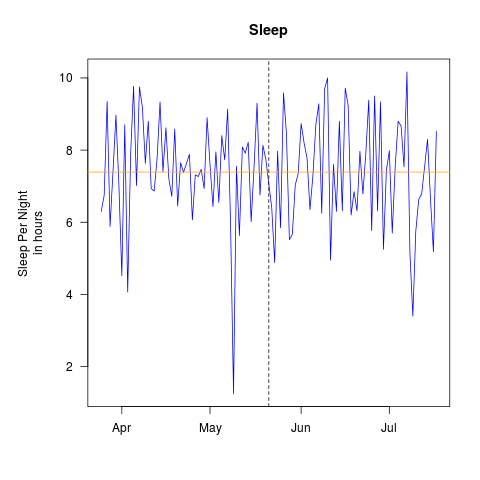

# SleepPattern
Checking for changes in sleep pattern before and after taking a new job.

# Background
After recently taking a new job that required a longer commute, I was curious if I was sleeping less due to this change. The dataset provided includes 48 days before and after the job change. 

# Data Dictionary
dateTime - Day level indicator

value - sleep in minutes

day - day of week name

weekendFlag - 1 if day is Saturday or Sunday else 0

hours- value /60

TimeFrame - determines if day is in the pre period ( before new job) or the post period (after new job)

# Sample R Code 
### clone the repo or read in the csv directly
```r
library(lubridate)
mydata <- read.csv("https://raw.githubusercontent.com/Spoted21/SleepPattern/master/SleepData.csv")
mydata$dateTime <- as.Date(mydata$dateTime)

# Try rolling up data to the week level
mydata$week <- floor_date(mydata$dateTime, "week")

# Check if you have equal sample size for "pre" and "post"
table(mydata$TimeFrame)

## Data Checking
library(lubridate)
mydata <- read.csv("https://raw.githubusercontent.com/Spoted21/SleepPattern/master/SleepData.csv")

# Try rolling up data to the week level
mydata$dateTime <- as.Date(mydata$dateTime)
mydata$week <- floor_date(mydata$dateTime, "week")
startDate <- as.Date("2018-05-21")


# Remove Weekends to avoid skewing the average sleep per night
noWeekends <- mydata %>% filter(weekendFlag!=1) %>%
  group_by(week ) %>%
  summarise(sleep = sum(value),
            days=n() ) 

# Make summary plot per night
png(filename = "SleepPerDay.png")
par(mar=c(5, 6, 4, 2) + 0.1)
plot(mydata$dateTime,mydata$value/60,type="l",
     ylab="Sleep Per Night \nin hours",
     xlab="",
     main="Sleep",las=1)
abline(h=mean(mydata$value/60),col="green",lty=2)
abline(v= as.numeric( startDate),col="red" )
dev.off()
```
# Sample Output


## Model Fitting
Start with something simple like a 2 sample t-test. First, we need to examine what the distributions for sleep look like pre and post.


